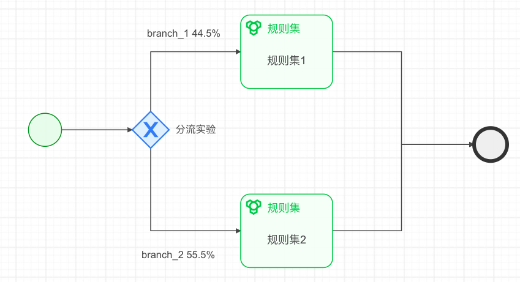
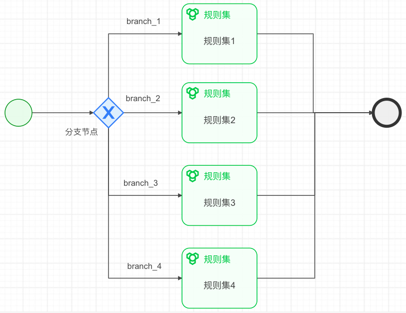

# 决策引擎提供接口 HTTP API
- [字段定义](#字段定义)
- [错误码定义](#错误码定义)
- [获取支持的决策流列表](#决策流列表)
- [执行决策流](#决策流执行)


### 字段定义

| 字段     | 说明                                                                                                   |
| -------- | ------------------------------------------------------------------------------------------------------ |
| key      | 决策流唯一标识 key                                                                                     |
| version  | 决策流版本号                                                                                           |


### 错误码定义

| 错误码 | 说明           |
| ------ | -------------- |
| 200    | 成功           |
| 400   | 请求参数错误   |
| 404   | 决策流不存在   |
| 500   | 未知错误       |

### 决策流列表

*HTTP*

GET http://HOST/engine/list

*请求参数*


*返回结果*

```json
{
	"code": 200,
	"error": "",
	"result": [{
		"key": "flow_ruleset",
		"version": "1.0",
		"md5": "46ef45be94e2f3c1ca23cc4ce9fe8947"
	}, {
		"key": "flow_abtest",
		"version": "1.0",
		"md5": "886ac3943749e9cf27b5033aad84a9b9"
	}, {
		"key": "flow_conditional",
		"version": "1.0",
		"md5": "df7a8a9431e38f1729d8d6788987df23"
	}, {
		"key": "flow_matrix",
		"version": "1.0",
		"md5": "37a47768ccb2b48d8585a16693d2279f"
	}]
}
```

*CURL*
```shell
curl http://localhost:8889/engine/list
```

### 决策流执行

*HTTP*

POST http://HOST/engine/run

*请求参数*

| 参数名   | 必选  | 类型              | 说明                             |
| -------- | ----- | ----------------- | -------------------------------- |
| key      | true  | string            | 决策流唯一标识                   |
| version  | true  | string            | 决策流版本                       |
| req_id   | true  | string            | 本次请求id                       |
| uid      | true  | string            | 用户id                           |
| features | false | json              | 依赖特征值列表                   |

*返回结果*

```json
*****成功*****
{
    "code":200,
    "error":"",
    "result":""
}
****失败****
{
    "code":400,
    "error":"入参错误",
    "result":""
}
```

- features 所有特征值，包括执行过程中产生的衍生特征和赋值特征
- hit_rules 命中的规则列表
- tracks 流执行轨迹
- node_results 各节点执行情况和产生值

*CURL*
```shell
curl -XPOST http://localhost:8889/engine/run -d '{"key":"flow_abtest", "version":"1.0", "req_id":"123456", "uid":1,"features":{"feature_1":5,"feature_2":3,"feature_3":55,"feature_4":32,"feature_5":33,"feature_6":231,"feature_7":2,"feature_8":4}}'
```

# 决策流案例
demo/ 下为所有可执行决策流案例
- [规则集决策流](#规则集决策流)
- [决策矩阵决策流](#决策矩阵决策流)
- [冠军挑战者决策流](#冠军挑战者决策流)
- [条件决策流](#条件决策流)
- [决策树决策流](#决策树决策流)
- [评分卡决策流](#评分卡决策流)
- [各类型特征决策流](#各类型特征决策流)

### 规则集决策流

- yaml 源文件: [demo/flow_ruleset](../demo/flow_ruleset.yaml)
- key: flow_ruleset
- version: 1.0


*CURL*
```shell
curl -XPOST http://localhost:8889/engine/run -d '{"key":"flow_ruleset", "version":"1.0", "req_id":"123456789", "uid":1,"features":{"feature_1":55,"feature_2":true,"feature_3":"a"}}'
```

*执行结果*
```json
{
	"code": 200,
	"error": "",
	"result": {
		"key": "flow_ruleset",
		"req_id": "123456789",
		"uid": 1,
		"features": [{
			"isDefault": false,
			"name": "feature_2",
			"value": true
		}, {
			"isDefault": false,
			"name": "feature_y",
			"value": "yyy"
		}, {
			"isDefault": false,
			"name": "feature_x",
			"value": "xxx"
		}, {
			"isDefault": false,
			"name": "feature_3",
			"value": "a"
		}, {
			"isDefault": false,
			"name": "feature_1",
			"value": 55
		}],
		"tracks": [{
			"index": 1,
			"label": "",
			"name": "start_1"
		}, {
			"index": 2,
			"label": "规则集1",
			"name": "ruleset_1"
		}],
		"hit_rules": [{
			"id": "2",
			"label": "规则2",
			"name": "rule_2"
		}, {
			"id": "1",
			"label": "规则1",
			"name": "rule_1"
		}],
		"node_results": [{
			"IsBlock": true,
			"Kind": "ruleset",
			"Score": 101,
			"Value": "reject",
			"id": 1,
			"label": "规则集1",
			"name": "ruleset_1",
			"tag": "internal"
		}, {
			"IsBlock": false,
			"Kind": "start",
			"Score": 0,
			"Value": null,
			"id": 0,
			"label": "",
			"name": "start_1",
			"tag": ""
		}],
		"start_time": "2022-07-18 21:54:04",
		"end_time": "2022-07-18 21:54:04",
		"run_time": 0
	}
}
```

### 决策矩阵决策流

- yaml 源文件: [demo/flow_matrix](../demo/flow_matrix.yaml)
- key: flow_matrix
- version: 1.0


*CURL*
```shell
curl -XPOST http://localhost:8889/engine/run -d '{"key":"flow_matrix", "version":"1.0", "req_id":"123456789", "uid":1,"features":{"feature_1":20,"feature_4":3}}'
```

*执行结果*
```json
{
	"code": 200,
	"error": "",
	"result": {
		"key": "flow_matrix",
		"req_id": "123456789",
		"uid": 1,
		"features": [{
			"isDefault": false,
			"name": "feature_1",
			"value": 20
		}, {
			"isDefault": false,
			"name": "feature_4",
			"value": 3
		}, {
			"isDefault": false,
			"name": "matrix_1",
			"value": "3"
		}, {
			"isDefault": false,
			"name": "my_matrix_1",
			"value": "3"
		}],
		"tracks": [{
			"index": 1,
			"label": "",
			"name": "start_1"
		}, {
			"index": 2,
			"label": "测试决策矩阵",
			"name": "matrix_1"
		}, {
			"index": 3,
			"label": "",
			"name": "end_1"
		}],
		"hit_rules": [{
			"id": "2",
			"label": "横轴2",
			"name": "rule_2"
		}, {
			"id": "3",
			"label": "纵轴3",
			"name": "rule_3"
		}],
		"node_results": [{
			"IsBlock": false,
			"Kind": "start",
			"Score": 0,
			"Value": null,
			"id": 0,
			"label": "",
			"name": "start_1",
			"tag": ""
		}, {
			"IsBlock": false,
			"Kind": "matrix",
			"Score": 0,
			"Value": "3",
			"id": 1,
			"label": "测试决策矩阵",
			"name": "matrix_1",
			"tag": "my_matrix"
		}, {
			"IsBlock": true,
			"Kind": "end",
			"Score": 0,
			"Value": null,
			"id": 0,
			"label": "",
			"name": "end_1",
			"tag": ""
		}],
		"start_time": "2022-07-18 22:28:20",
		"end_time": "2022-07-18 22:28:20",
		"run_time": 1
	}
}
```

### 决策树决策流

- yaml 源文件: [demo/flow_tree](../demo/flow_tree.yaml)
- key: flow_tree
- version: 1.0


*CURL*
```shell
curl -XPOST http://localhost:8889/engine/run -d '{"key":"flow_tree", "version":"1.0", "req_id":"123456789", "uid":1,"features":{"feature_num":-55,"feature_bool":false}}'
```

*执行结果*
```json
{
	"code": 200,
	"error": "",
	"result": {
		"key": "flow_tree",
		"req_id": "123456789",
		"uid": 1,
		"features": [{
			"isDefault": false,
			"name": "feature_bool",
			"value": false
		}, {
			"isDefault": false,
			"name": "feature_num",
			"value": -55
		}, {
			"isDefault": false,
			"name": "tree_1",
			"value": "f"
		}, {
			"isDefault": false,
			"name": "my_tree_feature",
			"value": "f"
		}],
		"tracks": [{
			"index": 1,
			"label": "",
			"name": "start_1"
		}, {
			"index": 2,
			"label": "测试决策树",
			"name": "tree_1"
		}, {
			"index": 3,
			"label": "",
			"name": "end_1"
		}],
		"hit_rules": [],
		"node_results": [{
			"IsBlock": false,
			"Kind": "start",
			"Score": 0,
			"Value": null,
			"id": 0,
			"label": "",
			"name": "start_1",
			"tag": ""
		}, {
			"IsBlock": false,
			"Kind": "tree",
			"Score": 0,
			"Value": "f",
			"id": 1,
			"label": "测试决策树",
			"name": "tree_1",
			"tag": "my_tree"
		}, {
			"IsBlock": true,
			"Kind": "end",
			"Score": 0,
			"Value": null,
			"id": 0,
			"label": "",
			"name": "end_1",
			"tag": ""
		}],
		"start_time": "2022-09-11 16:12:34",
		"end_time": "2022-09-11 16:12:34",
		"run_time": 1
	}
}
```

*执行过程分析*
开始->测试决策树->结束
决策树，从 block_1 开始，feature_bool = false 命中，goto block_3。feature_num < 1 命中，输出结果为 f，结束并赋值。

### 冠军挑战者决策流

- yaml 源文件: [demo/flow_abtest](../demo/flow_abtest.yaml)
- key: flow_abtest
- version: 1.0



*CURL*
```shell
curl -XPOST http://localhost:8889/engine/run -d '{"key":"flow_abtest", "version":"1.0", "req_id":"123456", "uid":3,"features":{"feature_1":20,"feature_3":"aaa","feature_4":4}}'
```

*执行结果*
```json
{
	"code": 200,
	"error": "",
	"result": {
		"key": "flow_abtest",
		"req_id": "123456",
		"uid": 3,
		"features": [{
			"isDefault": false,
			"name": "feature_1",
			"value": 20
		}, {
			"isDefault": false,
			"name": "feature_3",
			"value": "aaa"
		}, {
			"isDefault": false,
			"name": "feature_4",
			"value": 4
		}],
		"tracks": [{
			"index": 1,
			"label": "",
			"name": "start_1"
		}, {
			"index": 2,
			"label": "分流实验",
			"name": "abtest_1"
		}, {
			"index": 3,
			"label": "规则集1",
			"name": "ruleset_1"
		}, {
			"index": 4,
			"label": "",
			"name": "end_1"
		}],
		"hit_rules": [],
		"node_results": [{
			"IsBlock": true,
			"Kind": "end",
			"Score": 0,
			"Value": null,
			"id": 0,
			"label": "",
			"name": "end_1",
			"tag": ""
		}, {
			"IsBlock": false,
			"Kind": "start",
			"Score": 0,
			"Value": null,
			"id": 0,
			"label": "",
			"name": "start_1",
			"tag": ""
		}, {
			"IsBlock": false,
			"Kind": "abtest",
			"Score": 0,
			"Value": 30.010551178761848,
			"id": 11,
			"label": "分流实验",
			"name": "abtest_1",
			"tag": "tag_ab"
		}, {
			"IsBlock": false,
			"Kind": "ruleset",
			"Score": 0,
			"Value": null,
			"id": 1,
			"label": "规则集1",
			"name": "ruleset_1",
			"tag": "internal"
		}],
		"start_time": "2022-07-18 22:24:33",
		"end_time": "2022-07-18 22:24:33",
		"run_time": 1
	}
}
```

*执行过程分析*


### 条件决策流

- yaml 源文件: [demo/flow_conditional](../demo/flow_conditional.yaml)
- key: flow_conditional
- version: 1.0



*CURL*
```shell
curl -XPOST http://localhost:8889/engine/run -d '{"key":"flow_conditional", "version":"1.0", "req_id":"123456789", "uid":1,"features":{"feature_1":20,"feature_3":"xyzab","feature_4":55,"feature_5":44,"feature_6":"a","feature_a":false,"feature_b":1}}'
```

*执行结果*
```json
{
	"code": 200,
	"error": "",
	"result": {
		"key": "flow_conditional",
		"req_id": "123456789",
		"uid": 1,
		"features": [{
			"isDefault": false,
			"name": "feature_4",
			"value": 55
		}, {
			"isDefault": false,
			"name": "feature_5",
			"value": 44
		}, {
			"isDefault": false,
			"name": "feature_6",
			"value": "a"
		}, {
			"isDefault": false,
			"name": "feature_a",
			"value": false
		}, {
			"isDefault": false,
			"name": "feature_b",
			"value": 1
		}, {
			"isDefault": false,
			"name": "feature_1",
			"value": 20
		}, {
			"isDefault": false,
			"name": "feature_3",
			"value": "xyzab"
		}],
		"tracks": [{
			"index": 1,
			"label": "",
			"name": "start_1"
		}, {
			"index": 2,
			"label": "分支节点",
			"name": "conditional_1"
		}, {
			"index": 3,
			"label": "规则集3",
			"name": "ruleset_3"
		}, {
			"index": 4,
			"label": "",
			"name": "end_1"
		}],
		"hit_rules": [{
			"id": "5",
			"label": "规则5",
			"name": "rule_5"
		}],
		"node_results": [{
			"IsBlock": true,
			"Kind": "end",
			"Score": 0,
			"Value": null,
			"id": 0,
			"label": "",
			"name": "end_1",
			"tag": ""
		}, {
			"IsBlock": false,
			"Kind": "start",
			"Score": 0,
			"Value": null,
			"id": 0,
			"label": "",
			"name": "start_1",
			"tag": ""
		}, {
			"IsBlock": false,
			"Kind": "conditional",
			"Score": 0,
			"Value": "branch_3",
			"id": 1,
			"label": "分支节点",
			"name": "conditional_1",
			"tag": "ab"
		}, {
			"IsBlock": false,
			"Kind": "ruleset",
			"Score": 1,
			"Value": "record",
			"id": 3,
			"label": "规则集3",
			"name": "ruleset_3",
			"tag": "internal"
		}],
		"start_time": "2022-07-18 22:04:11",
		"end_time": "2022-07-18 22:04:11",
		"run_time": 1
	}
}
```

*执行过程分析*
开始->分支节点->规则集3（第三个分支）->结束
其中分支节点根据命中条件不同会进入 1-4 不同分支，由于 feature_a = false && feature_b <= 100 命中进入分支3，分支3对应规则集3。规则集3 （feature_3 LIKE xyz）命中，记录不阻塞流程。最后结束。


### 各类型特征决策流

- yaml 源文件: [demo/flow_multifeature](../demo/flow_multifeature.yaml)
- key: flow_multifeature
- version: 1.0

这里决策流用于展示各种数据类型的特征，每种特征支持不同的操作符类型。


*CURL*
```shell
curl -XPOST http://localhost:8889/engine/run -d '{"key":"flow_multifeature", "version":"1.0", "req_id":"123456789", "uid":1,"features":{"num_feature":55,"str_feature":"hello_test","bool_feature":false, "date_feature": "2022-08-29 23:59:59", "array_feature":[1, 3], "map_feature": {"key": "x"}}}'
```

*执行结果*
```json
{
	"code": 200,
	"error": "",
	"result": {
		"key": "flow_multifeature",
		"req_id": "123456789",
		"uid": 1,
		"features": [{
			"isDefault": false,
			"name": "num_feature",
			"value": 55
		}, {
			"isDefault": false,
			"name": "str_feature",
			"value": "hello_test"
		}, {
			"isDefault": false,
			"name": "bool_feature",
			"value": false
		}, {
			"isDefault": false,
			"name": "date_feature",
			"value": "2022-08-29T23:59:59Z"
		}, {
			"isDefault": false,
			"name": "array_feature",
			"value": [1, 3]
		}, {
			"isDefault": false,
			"name": "map_feature",
			"value": {
				"key": "x"
			}
		}],
		"tracks": [{
			"index": 1,
			"label": "",
			"name": "start_1"
		}, {
			"index": 2,
			"label": "规则集",
			"name": "ruleset_1"
		}, {
			"index": 3,
			"label": "",
			"name": "end_1"
		}],
		"hit_rules": [{
			"id": "4",
			"label": "日期规则",
			"name": "date_rule"
		}, {
			"id": "5",
			"label": "数组规则",
			"name": "array_rule"
		}, {
			"id": "6",
			"label": "字典规则",
			"name": "map_rule"
		}, {
			"id": "1",
			"label": "数值规则",
			"name": "num_rule"
		}, {
			"id": "2",
			"label": "字符串规则",
			"name": "str_rule"
		}, {
			"id": "3",
			"label": "布尔规则",
			"name": "bool_rule"
		}],
		"node_results": [{
			"IsBlock": false,
			"Kind": "start",
			"Score": 0,
			"Value": null,
			"id": 0,
			"label": "",
			"name": "start_1",
			"tag": ""
		}, {
			"IsBlock": false,
			"Kind": "ruleset",
			"Score": 6,
			"Value": "record",
			"id": 1,
			"label": "规则集",
			"name": "ruleset_1",
			"tag": "internal"
		}, {
			"IsBlock": true,
			"Kind": "end",
			"Score": 0,
			"Value": null,
			"id": 0,
			"label": "",
			"name": "end_1",
			"tag": ""
		}],
		"start_time": "2022-09-07 13:47:03",
		"end_time": "2022-09-07 13:47:03",
		"run_time": 1
	}
}
```

*执行过程分析*
开始->规则集->结束，其中规则集包含 5 条规则
- 数字规则: num_feature > 50 （num_feature = 55） 命中
- 字符串规则：str_feature LIKE test （str_feature = hello_test） 命中
- 布尔规则：bool_feature = false  (bool_feature = false)  命中
- 日期规则：date_feature BEFORE 2022-08-30  （date_feature = 2022-08-29 23:59:59） 命中
- 数组规则：array_feature IN [1, 3, 5, 7, 9]  （array_feature = [1, 3]） 命中
- 字典规则：map_feature VALUEEXIST x  （map_feature = {"key": "x"}）  命中

